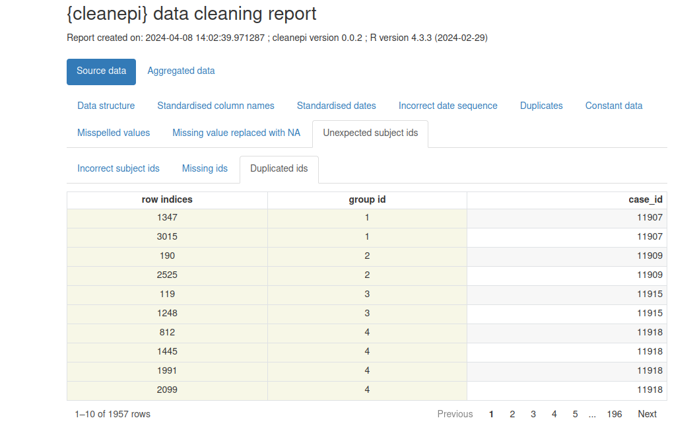

::: {.callout-note title="Perguntas"}

- Como limpar e padronizar dados de casos?

:::

::: {.callout-tip title="Objetivos"}

- Explicar como limpar, curar e padronizar dados de casos usando o pacote `{cleanepi}`.
- Realizar operações essenciais de limpeza de dados em um conjunto de dados de casos real.

:::

::: {.callout-important title="Pré-requisitos"}

Neste episódio, usaremos um conjunto de dados simulado de Ebola. Para acessá-lo:

- Baixe o arquivo [`simulated_ebola_2.csv`](../data/simulated_ebola_2.csv)
- Salve-o na pasta `data/`.

Você também precisa de:

**A versão mais recente do R:** Siga as instruções em Configuração para [configurar um Projeto e pasta no Positron (ou RStudio, se preferir)](../setup.qmd#setup-an-rstudio-project-and-folder)

**Pacotes do R instalados:** `{cleanepi}`, `{rio}`, `{here}`, `{tidyverse}`.

:::

::: {.callout-note title="Detalhes" collapse="true"}

Instale estes pacotes se eles ainda não estiverem instalados (se necessário, você pode configurar o espelho brasileiro do CRAN com `options(repos = c(CRAN = "https://cran-r.c3sl.ufpr.br/"))`):

```r
if (!base::require("pak")) install.packages("pak")
pak::pak(c("cleanepi", "rio", "here", "tidyverse"))
```

Se você encontrar alguma mensagem de erro,
acesse a [página principal de configuração](../setup.qmd#software-setup).

:::

## Introdução

No processo de análise de dados de surtos, como em outras disciplinas da ciência de dados, é essencial garantir que o conjunto de dados esteja limpo, curado, padronizado e validado.
Isso facilitará uma análise precisa (ou seja, você está analisando o que pensa que está analisando) e reproduzível (ou seja, se alguém quiser retornar e repetir as etapas da sua análise com o seu código, você terá a certeza de que obterá os mesmos resultados).

Este episódio foca na limpeza de dados de epidemias e surtos usando o pacote `{cleanepi}`.
Para fins de demonstração, trabalharemos com um conjunto de dados simulado de casos de Ebola.

### Configuração

Além do pacote `{cleanepi}`, usaremos os seguintes pacotes do R neste fluxo de trabalho de limpeza de dados:

- `{here}` para referenciar arquivos facilmente,
- `{rio}` para importar os dados no R,
- `{dplyr}` para realizar algumas operações de processamento de dados,
- `{magrittr}` para usar seu **operador pipe (`%>%`)**.

```{r, eval=TRUE, message=FALSE, warning=FALSE}
# Carregar pacotes
library(cleanepi)
library(rio) # para importar dados
library(here) # para referenciar arquivos facilmente
library(tidyverse) # para funções do {dplyr} e o pipe %>%
```

Se não estiverem instalados, use as caixas de `Pré-requisitos` e `Detalhes` acima.

::: {.callout-note title="Checklist"}

### O operador de dois pontos duplos (`::`)

O `::` no R permite acessar funções ou objetos de um pacote específico sem anexar o pacote inteiro ao caminho de busca (*search path*).
Ele oferece várias vantagens importantes, incluindo as seguintes:

- Informar explicitamente de qual pacote uma função provém, reduzindo a ambiguidade e potenciais conflitos quando vários pacotes têm funções com o mesmo nome.
- Permitir que você chame uma função de um pacote sem carregar o pacote inteiro com `library()`.

Por exemplo, o comando `dplyr::filter(data, condition)` significa que estamos chamando a função `filter()` do pacote `{dplyr}`.

:::

### Carregar dados

O primeiro passo é importar o conjunto de dados para o ambiente de trabalho.
Isso pode ser feito seguindo as orientações descritas no episódio [Ler dados de casos](01-ler-dados.qmd).
Isso envolve carregar o conjunto de dados no ambiente do `R` e visualizar sua estrutura e conteúdo.

```{r, eval=FALSE, echo=TRUE, message=FALSE}
# Ler dados
# por exemplo, se o caminho para o arquivo for data/simulated_ebola_2.csv então:
raw_ebola_data <- rio::import(
  here::here("data", "simulated_ebola_2.csv")
) %>%
  dplyr::as_tibble() # para uma saída simples em data frame
```

```{r, eval=TRUE, echo=FALSE, message=FALSE}
# Ler dados
raw_ebola_data <- rio::import(
  file.path("data", "simulated_ebola_2.csv")
) %>%
  dplyr::as_tibble() # para uma saída simples em data frame
```

```{r, eval=FALSE, echo=FALSE, message=FALSE}
# útil para ler no Positron
raw_ebola_data <- rio::import(
  here::here("episodes", "data", "simulated_ebola_2.csv")
) %>%
  dplyr::as_tibble() # para uma saída simples em data frame
```

```{r, message=FALSE}
# Imprimir o data frame
raw_ebola_data
```

::: {.callout-note title="Discussão"}

Vamos primeiro **diagnosticar** problemas de formato no data frame.
Liste todas as características no data frame acima que são problemáticas para a análise de dados.

Alguma dessas características é familiar de análises de dados anteriores que você já realizou?

:::

::: {.callout-important title="Para o instrutor" collapse="true"}

Conduza uma breve discussão para relacionar as características diagnosticadas com as operações de limpeza necessárias.

Você pode usar os seguintes termos para **diagnosticar características**:

- *Codificação*, como a codificação de valores em colunas como `gender` e `age` usando números, letras e palavras. Também a presença de múltiplos formatos de data ("dd/mm/yyyy", "yyyy/mm/dd", etc.) na mesma coluna, como em `date_onset`. Menos visível, mas também os nomes das colunas.
- *Valores ausentes*, como interpretar uma entrada como "" na coluna `status` ou "-99"
  em outras circunstâncias? Temos um dicionário de dados do processo de coleta de dados?
- *Inconsistências*, como ter uma data de coleta da amostra anterior à data de início dos sintomas.
- *Valores não plausíveis*, como observações em que alguns valores de datas estão fora do período esperado.
- *Duplicatas*, todas as observações são únicas?

Você pode usar estes termos para relacionar com as **operações de limpeza**:

- Padronizar nome da coluna
- Padronizar variáveis categóricas como 'gender'
- Padronizar colunas de datas
- Converter valores de caracteres em numéricos
- Verificar a sequência de eventos com datas

:::

## Uma inspeção rápida

A exploração e inspeção rápidas do conjunto de dados são cruciais para identificar possíveis problemas nos dados antes de iniciar qualquer tarefa de análise.
O pacote `{cleanepi}` simplifica esse processo com a função `scan_data()`.
Veja como você pode usá-la:

```{r}
cleanepi::scan_data(raw_ebola_data, format = "percentage")
```

Os resultados fornecem uma visão geral do conteúdo de todas as colunas de caracteres, incluindo os nomes das colunas e a porcentagem de alguns tipos de dados nelas contidos.
Você pode ver que os nomes das colunas no conjunto de dados são descritivos, mas não têm consistência.
Alguns são compostos por várias palavras separadas por espaços em branco.
Além disso, algumas colunas, como `date_onset`, contêm mais de um tipo de dados, o que significa que não podem ser imediatamente reconhecidas e transformadas para `<Date>`. Há valores ausentes na forma de string vazia `""` em algumas e `NA` em outras.

## Operações comuns

Esta seção demonstra como realizar algumas operações comuns de limpeza de dados usando o pacote `{cleanepi}`.

### Padronizar nomes de colunas

Para este conjunto de dados de exemplo, a padronização dos nomes das colunas envolve normalmente a remoção de espaços em branco e a ligação de diferentes palavras com "`_`". Essa prática ajuda a manter a consistência e a legibilidade no conjunto de dados. No entanto, a função usada para padronizar nomes de colunas oferece mais opções. Digite `?cleanepi::standardize_column_names` no console para mais detalhes.

```{r}
sim_ebola_data <- cleanepi::standardize_column_names(raw_ebola_data)
names(sim_ebola_data)
```

Se você quiser manter determinados nomes de colunas sem submetê-los ao processo de padronização, pode utilizar o argumento `keep` da função `cleanepi::standardize_column_names()`.
Esse argumento aceita um vetor de nomes de colunas que devem ser mantidos inalterados.

::: {.callout-tip .desafio title="Desafio"}

- Quais diferenças você observa nos nomes das colunas?

- Padronize os nomes das colunas do conjunto de dados de entrada, mas mantenha o nome da primeira coluna como está

::: {.callout-note title="Dica" collapse="true"}

Você pode tentar:

```r
cleanepi::standardize_column_names(data = raw_ebola_data, keep = "V1")
```

:::

:::

### Remover irregularidades

Dados brutos podem conter campos que não acrescentam nenhuma variabilidade aos dados, como linhas e colunas **vazias**, ou colunas **constantes** (onde todas as entradas têm o mesmo valor).
Eles também podem conter linhas **duplicadas**.
Funções do `{cleanepi}` como `remove_duplicates()` e `remove_constants()` removem essas irregularidades, como demonstrado no bloco de código abaixo.

```{r}
# Remover constantes
sim_ebola_data <- cleanepi::remove_constants(sim_ebola_data)
```

Imprima a saída para identificar qual coluna constante você removeu antes de remover duplicatas.

```{r}
# Remover duplicatas
sim_ebola_data <- cleanepi::remove_duplicates(sim_ebola_data)
```

<!-- Note que nosso Ebola simulado contém poucas duplicatas e poucas colunas constantes. -->

::: {.callout-note title="Detalhes" collapse="true"}

#### Quantas linhas você removeu? Quais linhas foram removidas?

Você pode obter o número e a localização das linhas duplicadas que foram encontradas. Execute `cleanepi::print_report()`, aguarde o relatório abrir no seu navegador e localize a aba "Duplicates".

Para usar essas informações no R, você pode imprimir data frames com seções específicas do relatório no console usando o argumento `what`.

```{r, eval=FALSE, echo=TRUE}
# Imprimir um relatório das duplicatas encontradas
cleanepi::print_report(data = sim_ebola_data, what = "found_duplicates")

# Imprimir um relatório das duplicatas removidas
cleanepi::print_report(data = sim_ebola_data, what = "removed_duplicates")
```

:::

::: {.callout-note}

**Aviso:** Ter constantes (e potencialmente às vezes duplicatas) nem sempre é um problema nos dados. Verifique esses casos antes de aceitar as alterações.

:::

::: {.callout-tip .desafio title="Desafio"}

No seguinte data frame:

```{r, echo=FALSE, eval=TRUE}
# criar conjunto de dados
df <- tibble::tibble(
  col1 = c(1, 2),
  col2 = c(1, 3)
) %>%
  dplyr::mutate(col3 = rep("a", nrow(.))) %>%
  dplyr::mutate(col4 = rep("b", nrow(.))) %>%
  dplyr::mutate(col5 = rep(NA_Date_, nrow(.))) %>%
  tibble::add_row(col1 = NA_integer_, col3 = "a") %>%
  tibble::add_row(col1 = NA_integer_, col3 = "a") %>%
  tibble::add_row(col1 = NA_integer_, col3 = "a") %>%
  tibble::add_row(col1 = NA_integer_)

df
```

Quais colunas ou linhas são:

- Colunas constantes?
- Linhas duplicadas?

::: {.callout-note title="Dica" collapse="true"}

Coluna constante: Uma coluna onde todos os valores são idênticos (ou todos ausentes). Elas não trazem nenhuma informação útil e geralmente podem ser removidas antes da análise.

Linhas duplicadas: Linhas onde todos os valores coincidem exatamente com os de outra linha. Duplicatas podem distorcer contagens e estatísticas, e muitas vezes indicam um problema na forma como os dados foram unidos ou exportados.

:::

::: {.callout-note title="Dica" collapse="true"}

Qual saída esperamos após executar `cleanepi::remove_constants()`? Por quê?

:::

:::

::: {.callout-important title="Para o instrutor" collapse="true"}

Certifique-se de que comecem removendo as duplicatas antes de remover dados constantes.

- índices das linhas duplicadas: 3, 4, 5
- índices das linhas vazias: 4 (da primeira iteração); 3 (da segunda iteração)
- colunas vazias: "col5"
- colunas constantes: "col3" e "col4"

```{r}
df %>% cleanepi::remove_constants()
```

:::

::: {.callout-note title="Detalhes" collapse="true"}

Também podemos avaliar a presença de duplicatas usando os IDs dos indivíduos. O pacote `{cleanepi}` oferece a função `check_subject_ids()`, projetada precisamente para essa tarefa, como mostrado no bloco de código abaixo.
Essa função verifica se os IDs são únicos e atendem aos critérios exigidos especificados pelo usuário. Você pode consultar mais informações no manual de referência sobre [Verificar se os IDs dos indivíduos estão em conformidade com o formato esperado. Quando IDs incorretos são encontrados, a função emite um aviso e o usuário pode chamar a função `correct_subject_ids` para corrigi-los.](https://epiverse-trace.github.io/cleanepi/reference/check_subject_ids.html)

:::

### Substituir valores ausentes

Além das irregularidades, os dados brutos podem conter valores ausentes, e estes podem estar codificados por diferentes strings (por exemplo, `"NA"`, `""`, `character(0)`). Para garantir uma análise robusta, é uma boa prática substituir todos os valores ausentes por `NA` em todo o conjunto de dados. Abaixo está um trecho de código demonstrando como você pode fazer isso no `{cleanepi}` para entradas ausentes representadas por uma string vazia `""`:

```{r}
sim_ebola_data <- cleanepi::replace_missing_values(
  data = sim_ebola_data,
  na_strings = ""
)

sim_ebola_data
```

Veja mais exemplos na caixa de detalhes abaixo:

::: {.callout-note title="Detalhes" collapse="true"}
 
Por padrão, o `{cleanepi}` suporta uma ampla variedade de formatos de valores ausentes, conforme listado no bloco de código abaixo:

```{r}
cleanepi::common_na_strings

missing_dat <- tibble::tribble(
  ~case_id, ~outcome, ~gender, ~hospital,
  "d1fafd", "NA", "f", "Military Hospital",
  "53371b", "nan", "na", "Connaught Hospital",
  "missing", "Recover", "f", "other",
  "6c286a", "Death", "null", "na",
  "NAN", "Recover", "f", "N/A"
)

# imprimir
missing_dat

# limpar
missing_dat %>%
  cleanepi::replace_missing_values()
```

:::

::: {.callout-note title="Checagem"}

Neste ponto, removemos uma série de colunas e linhas. Compare as dimensões de `raw_ebola_data` e `sim_ebola_data`.

:::

## Operações específicas de epidemiologia

Além das tarefas comuns de limpeza de dados, como as discutidas na seção anterior, o pacote `{cleanepi}` oferece funcionalidades adicionais desenvolvidas especificamente para processar e analisar dados de surtos e epidemias.
Esta seção aborda algumas dessas tarefas especializadas, focando principalmente em:

- colunas de datas (formato, sequência e intervalo de tempo entre duas ou mais),
- dicionários de dados para variáveis categóricas e
- conversão de números escritos em caracteres para valores numéricos.

### Padronizar datas

Um conjunto de dados de epidemia normalmente contém colunas do tipo `Date` para diferentes eventos, como data de infecção, data de início dos sintomas etc. Essas datas podem vir em diferentes formatos, e é uma boa prática padronizá-las para aproveitar as funcionalidades do R projetadas para lidar com valores de data nas análises seguintes. O pacote `{cleanepi}` fornece funcionalidade para converter colunas de datas de conjuntos de dados epidêmicos no formato ISO 8601, garantindo consistência entre as diferentes colunas de datas. Veja como você pode usá-la em nosso conjunto de dados simulado:

```{r}
sim_ebola_data <- cleanepi::standardize_dates(
  sim_ebola_data,
  target_columns = c("date_onset", "date_sample")
)

sim_ebola_data
```

Esta função converte os valores nas colunas-alvo para o formato **YYYY-mm-dd**.

::: {.callout-note title="Discussão"}

#### Como isso é possível?

Convidamos você a descobrir o pacote-chave que torna essa padronização possível dentro do `{cleanepi}` lendo a seção "Details" do [manual de referência de Standardize date variables](https://epiverse-trace.github.io/cleanepi/reference/standardize_dates.html#details).

Além disso, veja como usar o argumento `orders` se quiser trabalhar com strings no formato dos Estados Unidos (EUA).
Participe da discussão sobre [este exemplo reproduzível](https://github.com/epiverse-trace/cleanepi/discussions/262).

:::

::: {.callout-note title="No Brasil: formato de data"}

A convenção de escrita de datas no Brasil é **DD/MM/AAAA**, então, ao padronizar datas vindas de
sistemas de vigilância, o argumento `orders` costuma ser `c("dmy")`. Como este episódio mostra, o
caminho seguro é declarar explicitamente a ordem esperada em vez de deixar o R adivinhar.

:::


### Verificar a sequência de eventos com datas

Garantir a ordem e a sequência corretas de eventos com datas é crucial na análise de dados epidemiológicos, especialmente na análise de doenças infecciosas em que o momento de eventos como início dos sintomas e coleta de amostras é essencial.
O pacote `{cleanepi}` fornece uma função útil chamada `check_date_sequence()`, projetada para essa finalidade.

Aqui está um exemplo de bloco de código demonstrando o uso da função `check_date_sequence()` nos primeiros 100 registros do nosso conjunto de dados simulado de Ebola.

```{r, warning=FALSE, results="hide"}
# verificar as primeiras 100 linhas
sim_ebola_100 <- sim_ebola_data %>% dplyr::slice_head(n = 100)

# verificar a sequência de datas
cleanepi::check_date_sequence(
  data = sim_ebola_100,
  target_columns = c("date_onset", "date_sample")
)
```

Essa funcionalidade é crucial para garantir a integridade e a precisão dos dados em análises epidemiológicas, pois ajuda a identificar quaisquer inconsistências ou erros na ordem cronológica dos eventos, permitindo que você os trate de forma adequada.

::: {.callout-note title="Detalhes" collapse="true"}

#### Como remover observações inconsistentes?

O pacote `{cleanepi}` não remove automaticamente observações inconsistentes; ele apenas as identifica e relata seus índices.
Para removê-las, use o código abaixo: 

```{r, eval=TRUE, echo=TRUE}
# 1. Obter os índices das linhas incorretas a partir da saída do bloco de código acima
obs_incorrect <- c(
  8, 15, 18, 20, 21, 23, 26, 28, 29, 32, 34, 35,
  37, 38, 40, 43, 46, 49, 52, 54, 56, 58, 60, 63
)

# 2. Descartar observações com valores ausentes nas datas testadas
dat_without_missings_dates <- sim_ebola_100 %>%
  dplyr::filter(!(is.na(date_onset) | is.na(date_sample)))

# 3. Descartar observações inconsistentes
dat_without_missings_dates %>%
  dplyr::slice(-obs_incorrect)
```


> Note que verificamos um subconjunto de 100 linhas. O data frame completo contém mais de 600 sequências de datas incorretas. Experimente você mesmo!

:::

### Calcular o intervalo de tempo entre diferentes eventos com datas

Na análise de dados epidemiológicos, também é útil rastrear e analisar eventos dependentes do tempo a partir de uma linelist (lista de casos). 

- Um exemplo é o [atraso de notificação](../glossario.qmd#reportingdelay) (ou seja, o tempo decorrido da data de início dos sintomas do caso até a data de notificação do caso). No próximo conjunto de tutoriais, aprenderemos como levar isso em consideração na análise de surtos em tempo real.

- Outro exemplo é o atraso desde a data de coleta da amostra de um caso suspeito até a data em que a amostra foi testada (ou seja, com resultado conhecido), o que contribui para o atraso de notificação total ([Marinović et al., 2015](https://wwwnc.cdc.gov/eid/article/21/2/13-0504_article)). Isso pode subsidiar a avaliação da capacidade de testagem laboratorial da região que está respondendo ao surto.

- O exemplo mais comum é calcular a idade de todos os indivíduos a partir de suas datas de nascimento (ou seja, a diferença de tempo entre hoje e a data de nascimento).

O pacote `{cleanepi}` oferece uma função prática para calcular o tempo decorrido entre dois eventos com datas.

Por exemplo, o trecho de código abaixo utiliza a função `cleanepi::timespan()` para calcular o **atraso de notificação** entre a data de início dos sintomas (`date_onset`) e a data de confirmação do caso (`date_sample`):

```{r}
sim_ebola_data <- cleanepi::timespan(
  data = sim_ebola_data,
  target_column = "date_onset",
  end_date = "date_sample",
  span_unit = "days",
  span_column_name = "reporting_delay"
)

sim_ebola_data %>%
  dplyr::select(case_id, date_sample, reporting_delay)
```

Após a execução da função `cleanepi::timespan()`, uma nova coluna chamada `reporting_delay` é adicionada ao conjunto de dados **`sim_ebola_data`**.
Essa coluna representa o tempo decorrido calculado desde a data de início dos sintomas até a data de coleta da amostra, medido em dias.

Podemos descrever esse atraso usando uma visualização:

```{r}
# antes de gerar o gráfico:
# * manter IDs únicos,
# * manter um subconjunto plausível de observações consistentes (de 0 a 50 dias)
sim_ebola_delay <- sim_ebola_data %>%
  dplyr::distinct(case_id, .keep_all = TRUE) %>%
  dplyr::filter(reporting_delay >= 0, reporting_delay < 50)

sim_ebola_delay %>%
  ggplot(aes(x = reporting_delay)) +
  geom_histogram(binwidth = 1)
```

::: {.callout-note}

Também podemos usar **estatísticas de resumo** ou parâmetros de **distribuições de probabilidade** para descrever diferentes atrasos. Nós os usaremos nos próximos tutoriais. Para uma revisão, você pode consultar conceitos introdutórios em [alguns episódios que introduzem atrasos para dados de surto](https://epiverse-trace.github.io/tutorials/).

:::

::: {.callout-tip .desafio title="Desafio"}

Leia o data frame `test_df.RDS` dentro do pacote `{cleanepi}` para:

- Limpar e padronizar os elementos necessários para concluir isso.
- Calcular o tempo decorrido desde a data do teste positivo até a data de internação.
- Gerar o gráfico do atraso calculado usando o `{ggplot2}`, mantendo os valores plausíveis.

```{r}
dat <- readRDS(
  file = system.file("extdata", "test_df.RDS", package = "cleanepi")
) %>%
  dplyr::as_tibble()
```

::: {.callout-note title="Dica" collapse="true"}

Antes de calcular a idade, você pode precisar:

- padronizar os nomes das colunas
- padronizar as colunas de datas

Você pode precisar descartar os tempos negativos para visualizar valores plausíveis.

:::

::: {.callout-note .solucao title="Solução" collapse="true"}

```{r}
dat_clean <- dat %>%
  # padronizar nomes de colunas e datas
  cleanepi::standardize_column_names() %>%
  cleanepi::standardize_dates(
    target_columns = c("date_first_pcr_positive_test", "date_of_admission")
  ) %>%
  # calcular os atrasos em 'dias' do teste positivo até a internação
  cleanepi::timespan(
    target_column = "date_first_pcr_positive_test",
    end_date = "date_of_admission",
    span_unit = "days",
    span_column_name = "days_to_admission"
  )

dat_clean %>%
  dplyr::select(
    study_id,
    date_first_pcr_positive_test,
    date_of_admission,
    days_to_admission
  )

dat_clean %>% 
  dplyr::filter(days_to_admission >= 0) %>% 
  ggplot(aes(x = days_to_admission)) +
  geom_histogram(binwidth = 1)
```

:::

:::

O que diferencia `cleanepi::timespan()` de `dplyr::mutate()` é a facilidade com que você pode calcular diferenças de tempo em diferentes unidades de tempo (usando o argumento `span_unit`) e como você pode obter o tempo restante em uma coluna diferente e em uma unidade de tempo diferente (usando `span_remainder_unit`). Veja a caixa de detalhes abaixo para um exemplo:

::: {.callout-note title="Detalhes" collapse="true"}

Calcule a idade em anos de cada indivíduo até 3 de janeiro de 2025 (`"2025-01-03"`) a partir de sua data de nascimento, e o tempo restante em meses.

```{r}
dat_age <- dat_clean %>%
  # padronizar nomes de colunas e datas
  cleanepi::standardize_dates(
    target_columns = c("date_of_birth")
  ) %>%
  # calcular a idade em 'anos' e retornar o restante em 'meses'
  cleanepi::timespan(
    target_column = "date_of_birth",
    end_date = lubridate::ymd("2025-01-03"),
    span_unit = "years",
    span_column_name = "age_in_years",
    span_remainder_unit = "months"
  )

dat_age %>%
  dplyr::select(
    study_id,
    date_of_birth,
    age_in_years,
    remainder_months
  )
```

As colunas `age_in_years` e `remainder_months` são adicionadas ao conjunto de dados **`dat_age`**, com o tempo restante medido em `months`.

Para calcular a idade em anos **até a data de hoje**, você pode usar `Sys.Date()` como data final (`end_date`).

:::

### Substituição baseada em dicionário

No pré-processamento de dados, é comum encontrar cenários em que determinadas colunas de um conjunto de dados, como a coluna "gender" no nosso conjunto de dados simulado de Ebola, devem ter valores ou fatores específicos.
No entanto, também é comum que valores inesperados ou errôneos apareçam nessas colunas, os quais precisam ser substituídos pelos valores adequados.
O pacote `{cleanepi}` oferece suporte para substituição baseada em dicionário, um método que permite substituir valores em colunas específicas com base em mapeamentos definidos em um dicionário de dados.
Essa abordagem garante consistência e precisão na limpeza de dados.

Além disso, o `{cleanepi}` fornece um dicionário integrado desenvolvido especificamente para dados epidemiológicos.
O dicionário de exemplo abaixo inclui mapeamentos para a coluna "gender".

```{r}
test_dict <- base::readRDS(
  system.file("extdata", "test_dict.RDS", package = "cleanepi")
) %>%
  dplyr::as_tibble()

test_dict
```

Agora, podemos usar esse dicionário para padronizar os valores da coluna "gender" de acordo com categorias predefinidas. Abaixo está um exemplo de bloco de código demonstrando como realizar isso usando a função `clean_using_dictionary()` do pacote `{cleanepi}`.

```{r}
sim_ebola_data <- cleanepi::clean_using_dictionary(
  data = sim_ebola_data,
  dictionary = test_dict
)

sim_ebola_data
```

Essa abordagem simplifica o processo de limpeza de dados, garantindo que variáveis categóricas em conjuntos de dados epidemiológicos sejam categorizadas com precisão e estejam prontas para análises posteriores.

::: {.callout-note title="Detalhes" collapse="true"}

#### Como criar seu próprio dicionário de dados?

Observe que quando uma coluna no conjunto de dados contém valores que não estão no dicionário, a função `cleanepi::clean_using_dictionary()` gerará um erro. 
Você pode iniciar um dicionário personalizado com um data frame dentro ou fora do R e usar a função `cleanepi::add_to_dictionary()` para incluir novos elementos no dicionário. Por exemplo:

```{r}
new_dictionary <- tibble::tibble(
  options = "0",
  values = "female",
  grp = "sex",
  orders = 1L
) %>%
  cleanepi::add_to_dictionary(
    option = "1",
    value = "male",
    grp = "sex",
    order = NULL
  )

new_dictionary
```

Há mais detalhes na seção sobre "Dictionary-based data substituting" na [vinheta](https://epiverse-trace.github.io/cleanepi/articles/cleanepi.html#dictionary-based-data-substituting) do pacote.

:::

### Conversão para valores numéricos

No conjunto de dados brutos, algumas colunas podem vir com uma mistura de valores de caracteres e numéricos, e com frequência você desejará converter explicitamente valores de caracteres que representam números em valores numéricos (por exemplo, `"seven"` para `7`).
Por exemplo, em nosso conjunto de dados simulado, algumas entradas na coluna de idade estão escritas por extenso.
No `{cleanepi}`, a função `convert_to_numeric()` realiza essa conversão, como ilustrado no bloco de código abaixo.

```{r}
sim_ebola_data <- cleanepi::convert_to_numeric(
  data = sim_ebola_data,
  target_columns = "age"
)

sim_ebola_data
```

::: {.callout-note}

### Suporte a múltiplos idiomas

Graças ao pacote `{numberize}`, podemos converter números escritos em inglês, francês ou espanhol em valores inteiros positivos.

:::

## Múltiplas operações de uma só vez

Você pode combinar várias tarefas de limpeza de dados por meio do pipe do R base (`|>`) ou do operador pipe do `{magrittr}` (`%>%`), conforme mostrado no trecho de código abaixo.

```{r, warning=FALSE, message=FALSE}
# Realizar as operações de limpeza usando o operador pipe (%>%)
cleaned_data <- raw_ebola_data %>%
  # operações comuns ---------------------------------------
  cleanepi::standardize_column_names() %>%
  cleanepi::remove_constants() %>%
  cleanepi::remove_duplicates() %>%
  cleanepi::replace_missing_values(na_strings = "") %>%
  cleanepi::check_subject_ids(
    target_columns = "case_id",
    range = c(1, 15000)
  ) %>%
  # operações epidemiológicas ------------------------------
  cleanepi::standardize_dates(
    target_columns = c("date_onset", "date_sample")
  ) %>%
  cleanepi::check_date_sequence(
    target_columns = c("date_onset", "date_sample")
  ) %>%
  cleanepi::timespan(
    target_column = "date_onset",
    end_date = "date_sample",
    span_unit = "days",
    span_column_name = "reporting_delay"
  ) %>%
  cleanepi::clean_using_dictionary(dictionary = test_dict) %>%
  cleanepi::convert_to_numeric(target_columns = "age")
```

```{r, echo=FALSE, eval=TRUE}
cleaned_data %>%
  write_csv(file = file.path("data", "cleaned_data.csv"))
```

::: {.callout-note title="Detalhes" collapse="true"}

Realizar operações de limpeza de dados individualmente pode ser demorado e sujeito a erros.
O pacote `{cleanepi}` simplifica esse processo oferecendo uma função *wrapper* conveniente chamada `clean_data()`, que permite realizar múltiplas operações de uma só vez.

Quando nenhuma operação de limpeza é especificada, a função `clean_data()` aplica automaticamente uma série de operações de limpeza de dados ao conjunto de dados de entrada.
Aqui está um exemplo de bloco de código ilustrando como usar `clean_data()` em um conjunto de dados simulado bruto de Ebola:

```{r}
one_step_clean_data <- cleanepi::clean_data(raw_ebola_data)
```

:::

::: {.callout-tip .desafio title="Desafio"}

Você notou que o `{cleanepi}` contém um conjunto de funções para **diagnosticar** o status de limpeza do conjunto de dados e outro conjunto para **executar** ações de limpeza nele?

Para identificar ambos os grupos:

- Em um pedaço de papel, escreva os nomes de cada função sob a coluna correspondente:

| **Diagnosticar** status de limpeza | **Executar** ação de limpeza | 
| ---------------- | ---------------- |
| ...              | ...              | 

:::

::: {.callout-important title="Para o instrutor" collapse="true"}

Observe que o `{cleanepi}` contém um conjunto de funções para **diagnosticar** o status de limpeza (por exemplo, `check_subject_ids()` e `check_date_sequence()` no bloco acima) e outro conjunto para **executar** uma ação de limpeza (as funções complementares do bloco acima).

:::

## Relatório de limpeza

O pacote `{cleanepi}` gera um relatório abrangente detalhando os achados e as ações de todas as operações de limpeza de dados realizadas durante a análise. 

Este relatório é apresentado como um arquivo `HTML`. Se ele não abrir automaticamente, acesse a pasta temporária. Copie o caminho impresso no console do R, vá até o gerenciador de arquivos local, cole o caminho na barra de busca e você encontrará o arquivo `HTML`.

Cada seção corresponde a uma operação específica de limpeza de dados, e clicar em cada seção permite acessar os resultados daquela operação em particular. Essa abordagem interativa permite que os usuários revisem e analisem com eficiência os efeitos de cada etapa individual de limpeza dentro do processo mais amplo de limpeza de dados.

Você pode visualizar o relatório usando:

```r
cleanepi::print_report(data = cleaned_data)
```

<figure>
    
    <figcaption>Exemplo de relatório de limpeza de dados gerado pelo <code>{cleanepi}</code></figcaption>
</figure>

::: {.callout-note title="Pontos-chave"}

- Use o pacote `{cleanepi}` para limpar e padronizar dados epidemiológicos
- Compreenda como usar o `{cleanepi}` para realizar tarefas comuns de limpeza de dados
- Visualize o relatório de limpeza de dados em um navegador, consulte-o e tome decisões.

:::
